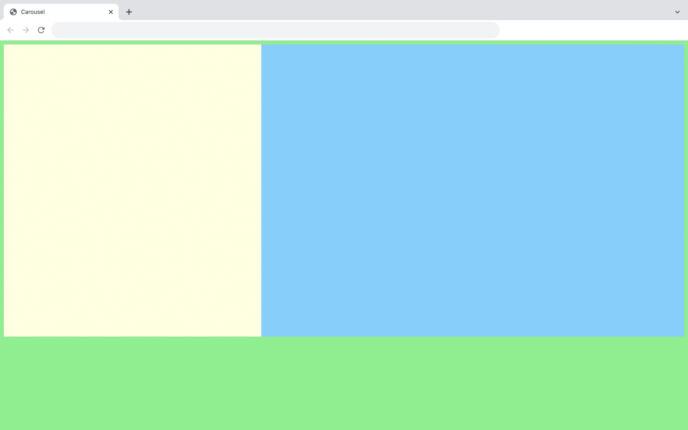

# Carousel

This code creates a carousel including several divs. It's only based on CSS (no js required) and uses ancors. 
Personalised cursors and texts can be add thanks to links "carousel__prev" and "carousel__next"

# Demos screenshots 

  
