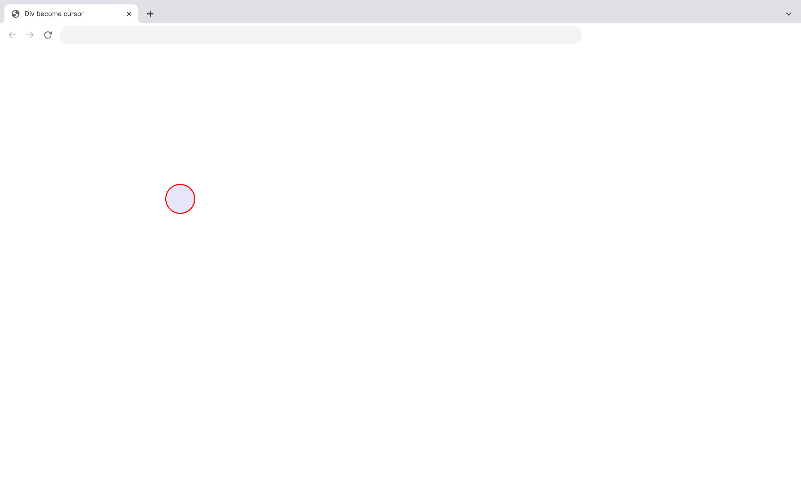
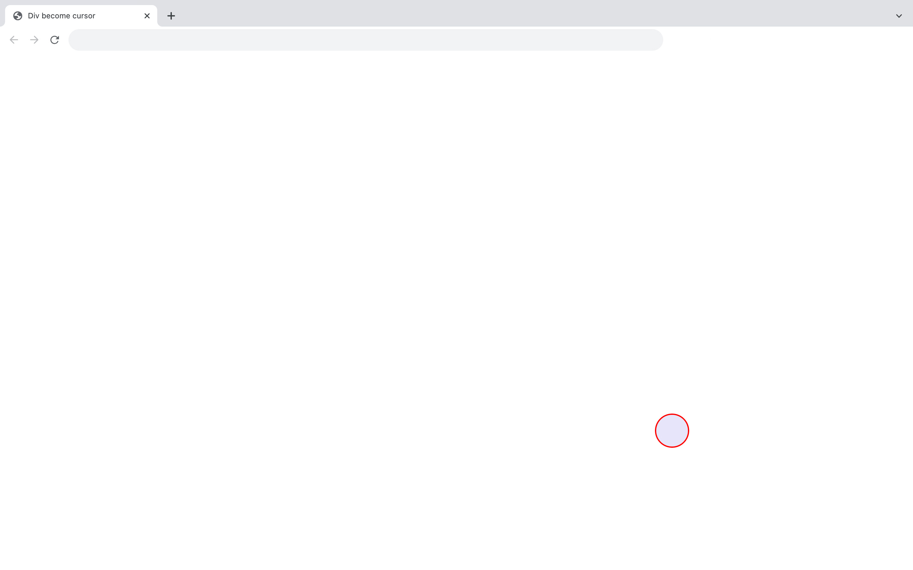
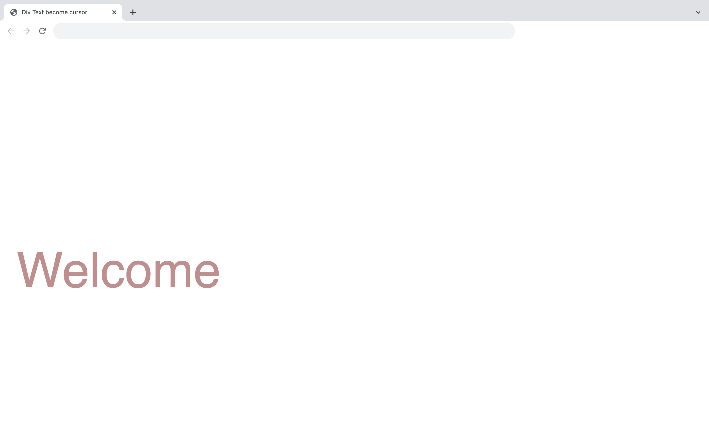

# Div become cursor

This code allows any div to replace the page cursor. It's a great way to get a high-quality custom cursor.   
The cursor can be a shape, text or image: it can be anything a div can be.  
index-01.html = example with a shape 
index-02.html = example with a text

# Demos screenshots 

  
  
  

