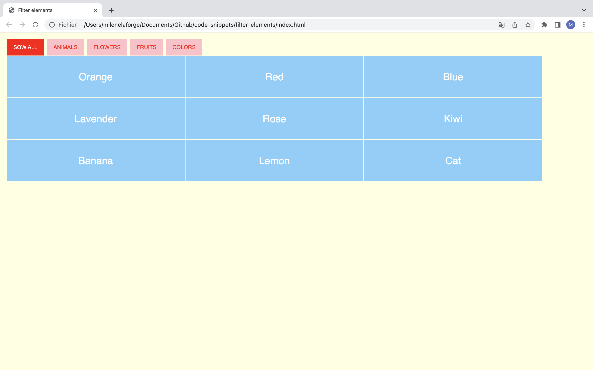
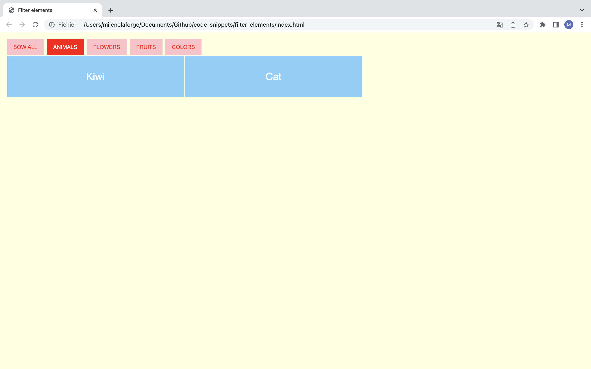
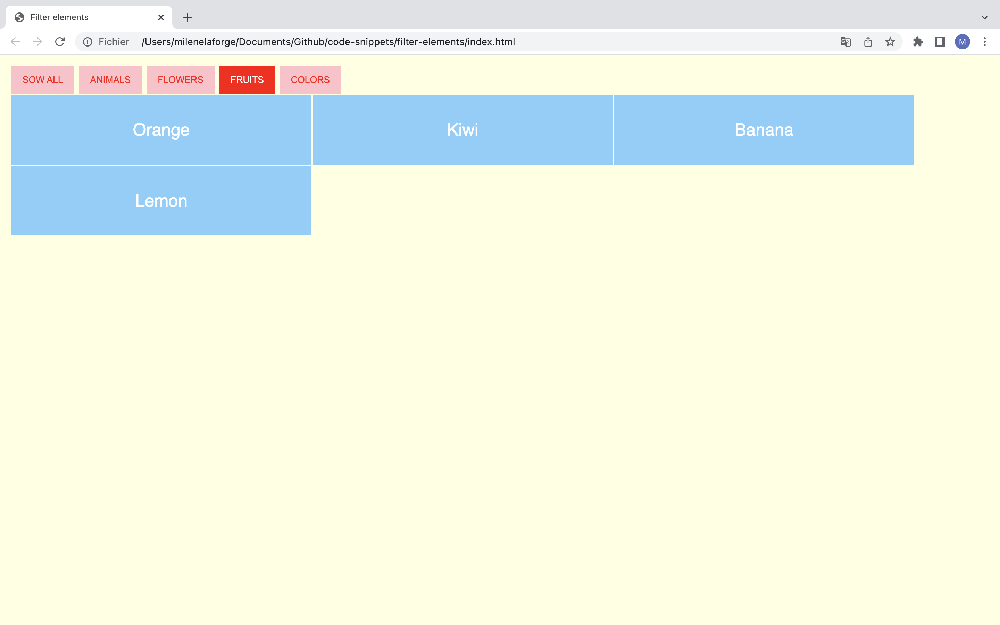
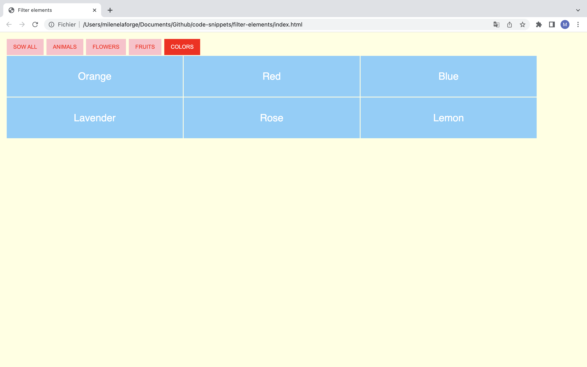

# Filter elements

This code offers a simple filtering functionality for elements on a webpage.   
The code allows you to filter elements based on their categories by clicking on corresponding buttons. One element can belong to several categories. 

# Demos screenshots 

  
  
  
  

