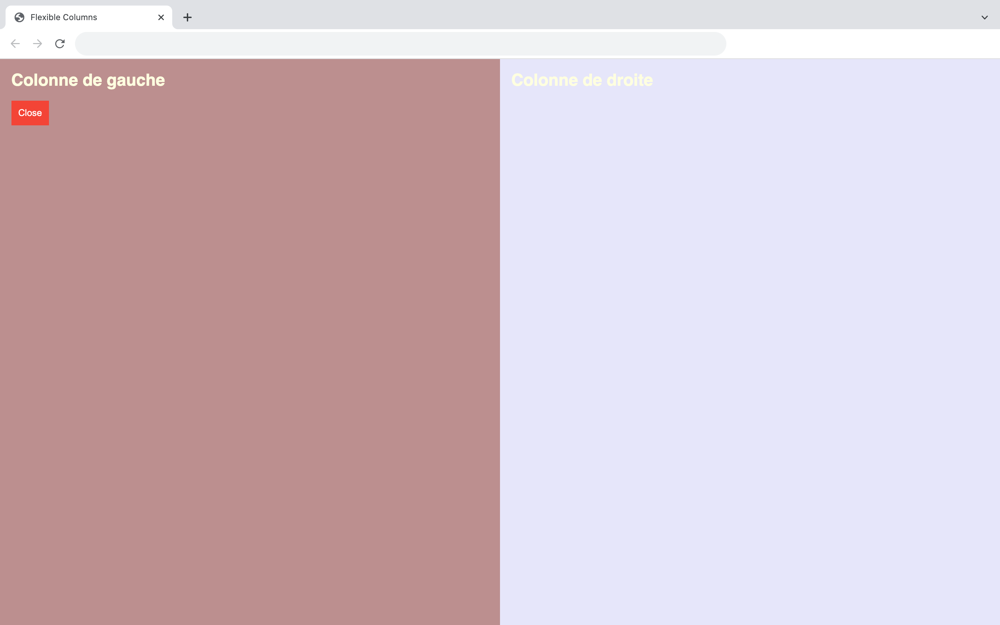

# Flexible columns

This code offers a simple two-column layout where can proportionnaly inscrease the size of right-colmun when you reduce left-column one's. 
It uses flex proportions. 

# Demos screenshots 

  
  
