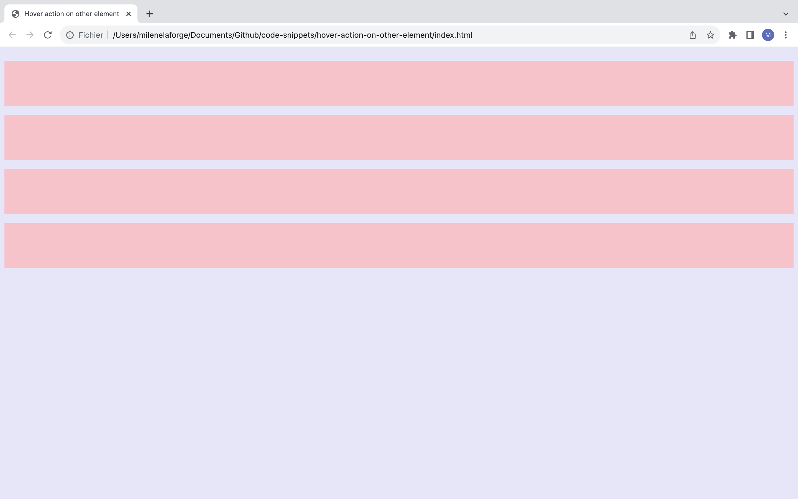

# Hover action on other element

This snippet allows to act on other divs while hovering one. 
You can set as many css options as you want: opacity, filters, background-color, text-color, visibility…

# Demos screenshots 

 
