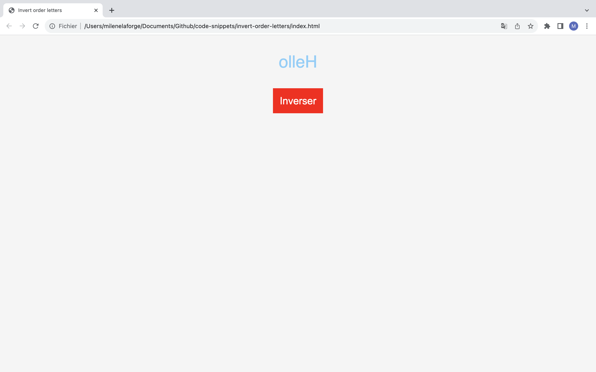

# Invert order letters

Simple code to invert letters in each word of the text by cliking on a button.   
An alternative would be to use a hover (in a menu, for example). 

# Demos screenshots 

  
