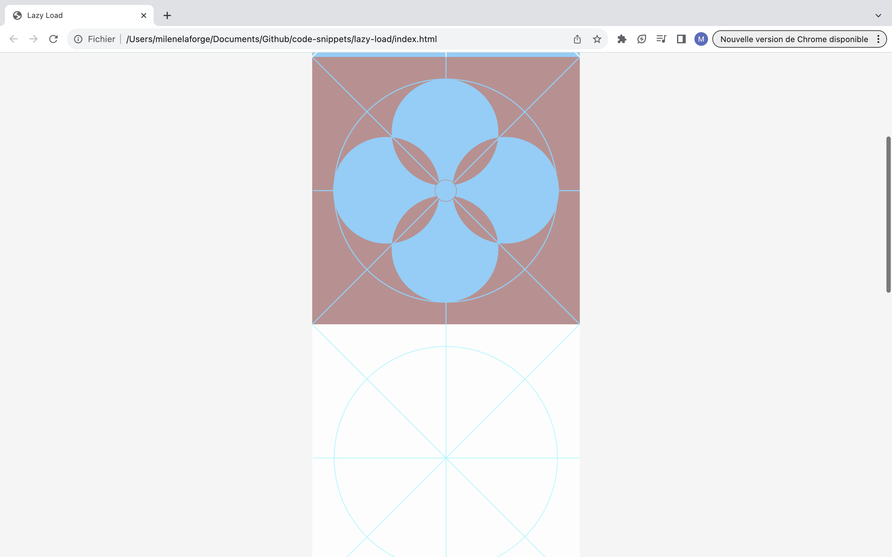

# Lazy Load

Code snippets that enables images to be loaded progressively as we scroll down the page.   
The display options are set using the fade-in and fade-in-active classes in css. 

# Demos screenshots 

  
