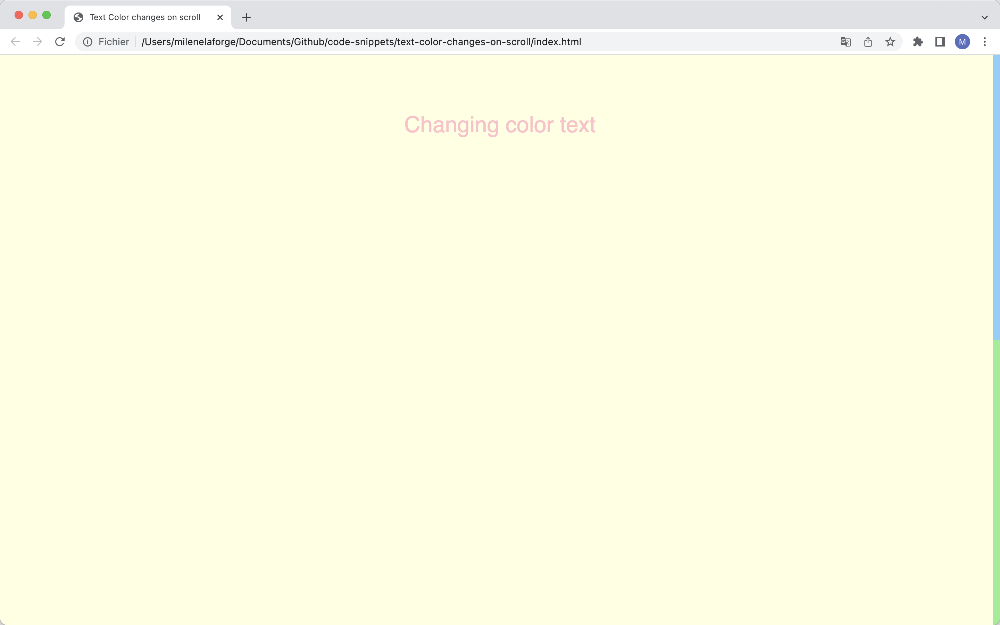
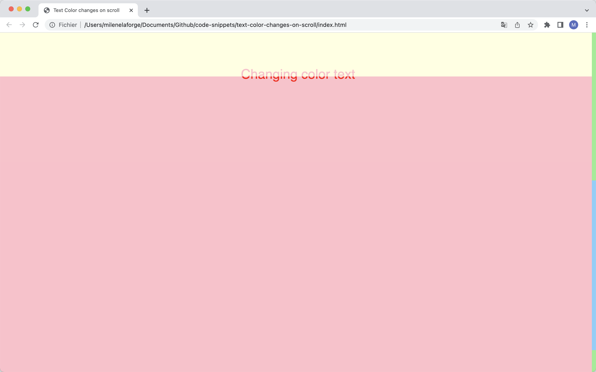

# Text color changes on scroll

This code allows to change the css of a text (for example the color, but it can also be the font, background-color, style…) when it enters a new div on scroll.

# Demos screenshots 

  
  
