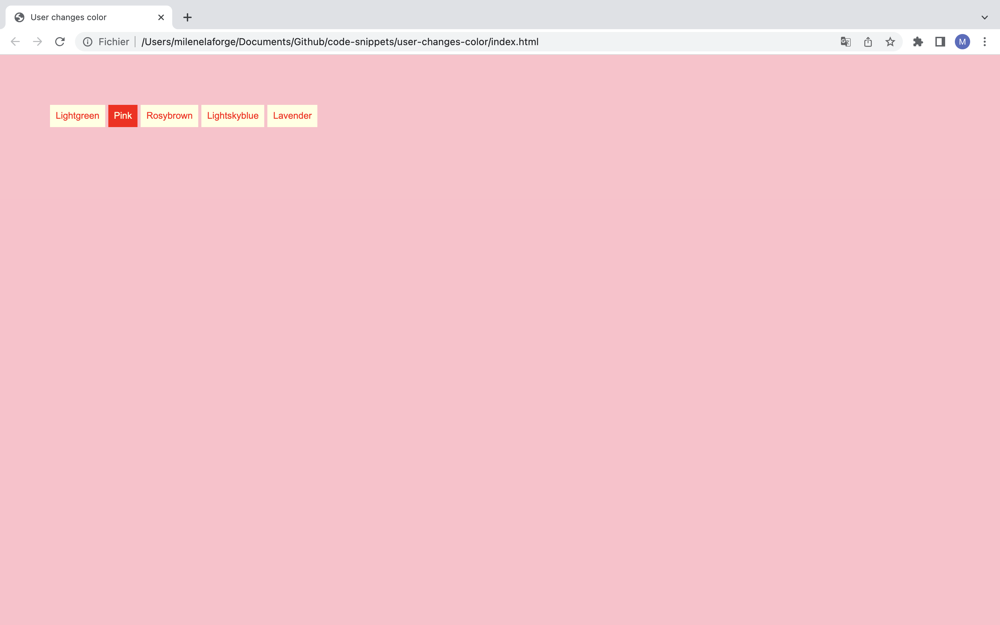
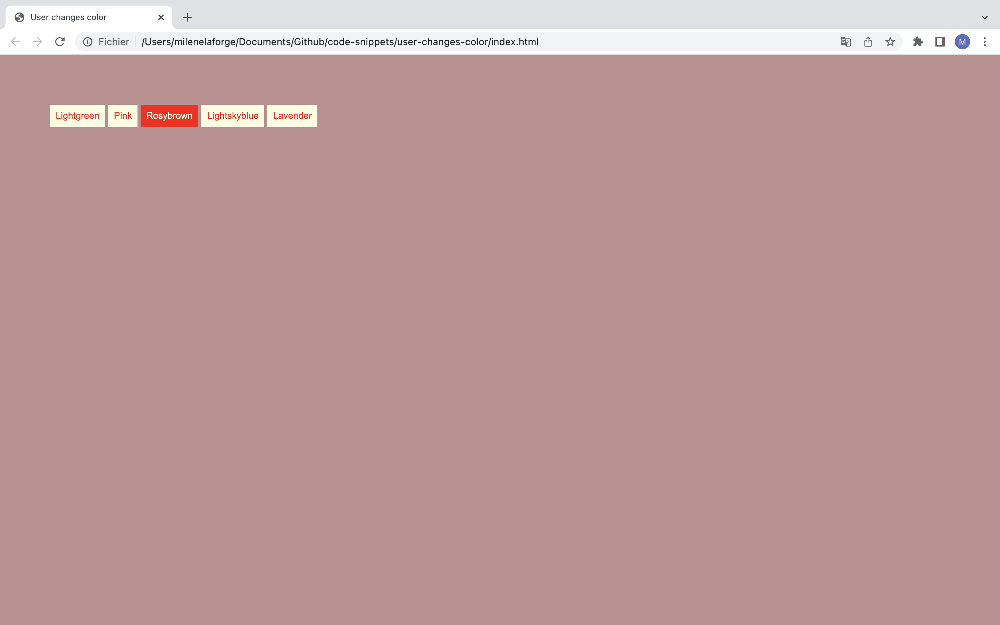
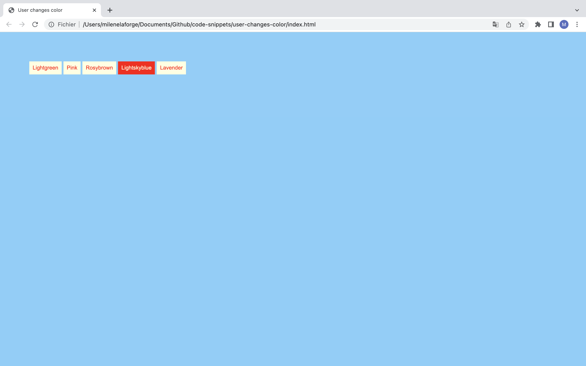

# User changes color

This code allows the user to customize the web page (example background-color).   
The js is directly built to define the css background color according to the innerHTMl of each button. 

# Demos screenshots 

  
  
  
